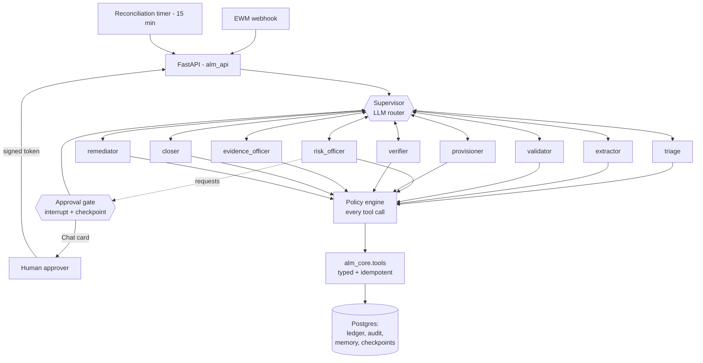

# Autonomous ALM Provisioning — Architecture

> Implements [docs/Autonoums Agent Plan.md](Autonoums%20Agent%20Plan.md).
> Status: **code complete; never run against the live estate.** Written without
> access to the intranet, the Google Cloud project or Cloud DNS. Nothing here has
> run against EWM, JTS, GPT, Postgres or Pub/Sub. The agent layer *is* exercised
> end to end offline - a scripted model against a simulated estate, in CI - and
> can be run with a real Gemini model on a laptop (section 2a). Treat every claim
> about the corporate integration as a design statement, not a test result.
>
> This is a genuine multi-agent system: an LLM supervisor routes nine agents,
> each of which runs its own tool-calling loop and decides its own actions.
> Section 2 is the part to read before a security review - it describes exactly
> what the models can and cannot cause.

The existing CLI (`src/*.py`) is untouched and still works exactly as before.
This is an additive second implementation of the same operations, built for
unattended operation.

---

## 1. The shape of it



There are no fixed edges between agents. The supervisor reads what has been
established and chooses who acts next, so the sequence differs between runs: a
batch where every user is already active never reaches the provisioner, a run
that hits a transient failure visits the remediator, and an agent can hand
directly to a peer when it knows who should continue.

### Layers

| Package | Responsibility | Reasons? |
|---|---|---|
| `alm_api` | Webhook receiver, approval endpoints, run queries | No |
| `alm_agents` | Supervisor, nine agents, policy, memory, tool wrappers | **Yes** |
| `alm_core` | Contracts, tools, transport, persistence | **Never** |
| `alm_worker` | Domain-joined Windows worker for AD group changes | No |

`alm_core` importing the agent layer is a CI failure. The tool layer executes;
it does not decide.

---

## 2. The agents, and what constrains them

Nine agents, each with the narrowest toolset that lets it work. An agent asked
to do something outside its toolset has exactly one legal move: hand off.

| Agent | Decides | Can write? |
|---|---|---|
| `triage` | What is in scope, what looks unusual | No |
| `extractor` | Which user IDs are genuinely present, including in malformed fields | No |
| `validator` | The true registry state and risk of each user | No |
| `risk_officer` | Whether the batch should go to a human at all, and what to tell them | No |
| `provisioner` | Order and manner of the JTS and AD changes | **Yes** |
| `verifier` | Who actually holds the access | No |
| `evidence_officer` | What proof to capture and attach | **Yes** |
| `closer` | What each work item is told | **Yes** |
| `remediator` | Retry, escalate, or leave alone | No |

### Where safety lives now

The previous design kept the model out of the write path entirely. That is no
longer true, and pretending otherwise would be the dangerous version. Agents
call write tools directly. The guarantees moved to the tool boundary, where they
are mechanical rather than persuasive:

**`alm_agents/policy.py` checks every tool call before it runs.** A denial is
returned to the agent as an observation, not raised as an exception - an agent
told *"you may not write yet; call request_human_approval first"* adapts, which
is the behaviour we want. What it cannot do is proceed anyway.

The invariants, in evaluation order:

1. Writes are impossible in shadow mode.
2. Writes require an `ApprovalDecision` from a human covering that specific user.
3. Production writes require the run to carry a production confirmation.
4. A run has a write budget and a shared tool-call budget.
5. User IDs must match the estate's pattern - a hallucinated identifier never
   reaches LDAP.
6. No agent may write to the audit trail.

Underneath the policy, `guarded_write` still applies shadow mode, approval,
idempotency claim and audit to every write. An agent that somehow reached a
write tool without an approval would still be refused there. Two independent
layers, because one of them is new.

### What the model can and cannot cause

| | |
|---|---|
| **Can** | Choose which agent acts next, in what order, and how many times |
| **Can** | Decide which tools to call, with which arguments, and when to stop |
| **Can** | Hand work to another agent, request human approval, write memory |
| **Can** | Perform an approved write, on an approved user, once |
| **Cannot** | Write anything without a human approval naming that user |
| **Cannot** | Write in shadow mode, or beyond the run's write budget |
| **Cannot** | Grant itself or another agent a tool the roster did not give it |
| **Cannot** | Act on a user ID that does not match the estate's pattern |
| **Cannot** | Alter or suppress an audit row, or route around a denial |

### Bounds on autonomy

- **Hops** (`ALM_MAX_HOPS`, default 24) - routing decisions per run. A supervisor
  oscillating between two agents cannot do so indefinitely.
- **Iterations** - per agent run, from the roster definition.
- **Tool calls** (`ALM_MAX_TOOL_CALLS_PER_RUN`, default 400) - shared across all
  agents.
- **Writes** (`ALM_MAX_WRITES_PER_RUN`, default 50) - a hard ceiling regardless
  of what any agent concludes.
- **Wall clock** - per agent run.
- **Explicit termination** - "done" is a `finish` call an agent makes, not
  something inferred from silence.

### When the model is unavailable

The supervisor falls back to the nominal sequence, so a routing-model outage
degrades the system to the deterministic workflow rather than stopping it. The
agents themselves need a model; if none can be built, `ALM_ORCHESTRATION=deterministic`
runs the fixed graph with identical tools and guarantees.

---

## 2a. Where the AI is

Every model call in the system goes through one file, `alm_agents/llm.py`. Three
clients come out of it:

| Client | Used by | What it does |
|---|---|---|
| `get_agent_llm` | all nine agents (`agent.py`) | Reads the task, calls tools, reads the results, decides the next call, stops with `finish` or `handoff` |
| `get_supervisor_llm` | the supervisor (`supervisor.py`) | Reads the run state and picks which agent acts next. One small JSON answer per hop |
| `get_client` | extraction fallback and comment drafting | Narrow helpers whose output is validated and discarded if it overreaches |

### User IDs are selected, never generated

When a New Users row cannot be parsed, `recover_userids` (in `llm.py`) does not
ask a model to write the user IDs out. Code lists every token in the row shaped
like a user ID, and a model only judges which of those tokens are people being
requested. The ID that comes back is the token copied from the row, so an
invented ID cannot come out, whichever model judged it. The deterministic graph
uses this through `extract_users`; the extractor agent through its
`recover_user_ids` tool.

The judge is [TypeSafe](https://docs.typesafe.ai)'s Jev model when
`TYPESAFE_API_KEY` is set: one yes/no question (a Noul) per candidate, each
answered with a probability. Otherwise Gemini judges, held to the same list of
candidates. Every recovered user is HIGH risk and reaches the approver with its
probability on the card. `ALM_EXTRACTION_MIN_PROBABILITY` (default 0.5) is a
placeholder until it is tuned on real malformed rows.

TypeSafe is an external internet API. The Cloud Run network as deployed has no
internet egress, so in the cloud recovery uses Gemini unless an egress path to
`api.typesafe.ai` is deliberately added - a network-policy decision, not a
default.

The models are Gemini, reached one of two ways (`ALM_LLM_PROVIDER`):

| Provider | Authenticates with | Use it for |
|---|---|---|
| `gemini_api` | An API key from Google AI Studio (`GEMINI_API_KEY`, or the `alm-gemini-api-key` secret) | A laptop, the sandbox, a first try. Free tier is heavily rate limited |
| `vertex` | The Cloud Run service account - no key exists | Production. Same Gemini models; project quotas; data stays under the project's terms. Also the only route to Claude models |

Both use the same client class (`ChatGoogleGenerativeAI`), so switching is a
setting. Three details matter in practice:

- **One rate limiter for the process** (`ALM_LLM_REQUESTS_PER_MINUTE`). The quota
  belongs to the key, not to an agent; nine agents each pacing themselves would
  together exceed it nine times over.
- **Thinking is kept low** (`ALM_LLM_THINKING_LEVEL`). Gemini 3 reasons before it
  answers by default; tool routing needs little of that, and on the free tier
  the extra latency and tokens are the difference between a run finishing or not.
- **Tool schemas are reduced to what Gemini accepts** (`agent.portable_schema`).
  Pydantic emits `$ref`, `anyOf` and `title`; Gemini's function declarations
  reject some of those. The constraints are not lost - pydantic still validates
  every argument before a tool runs.

### Running the agents on a laptop

The real tools need the corporate network. `alm_agents/sandbox.py` swaps only
the systems behind them for a simulated estate - five users in known states,
including an archived account, one already active, one missing from LDAP and one
buried in a malformed row - and keeps everything that decides or guards real:
the Gemini model, the agents, the supervisor, the policy engine, the approval
interrupt, `guarded_write` and the evidence gate.

```powershell
# once: put GEMINI_API_KEY=... in .env (gitignored)
python src/agent_sandbox.py --check          # key valid? model available? tool calling works?
python src/agent_sandbox.py                  # full run; you approve at the gate
python src/agent_sandbox.py --auto-approve   # unattended
python src/agent_sandbox.py --shadow         # plan only
```

The run prints each routing decision and tool call as it happens, pauses at the
approval gate for a `y/N`, and writes the full report and audit trail to
`out/sandbox/`. A sandbox run says whether the agents behave; it says nothing
about whether the corporate endpoints are reachable - that is `alm_core.smoke`.

---

## 3. What makes a write safe

`alm_core/tools/base.py::guarded_write` is the only way to write, and it enforces
four things in order:

| Guard | What it stops |
|---|---|
| Shadow mode | The pilot reads and plans; writes become recorded no-ops |
| Approval | A write with no human decision covering that user raises |
| Idempotency claim | A replayed webhook returns the original result instead of writing twice |
| Audit | Every attempt produces a row, including replays and failures |

The idempotency key is `sha256(work_item_id + userid + operation)` — deliberately
free of run ids and timestamps, so a redelivered webhook, a retried node and a
manual re-run all derive the *same* key and collapse into one write.

The ledger has three states, and the distinction matters: **claimed** (proceed),
**completed** (return the original result), **in flight** (another worker owns
it — unless the claim is older than the 15-minute lease, in which case that
worker died and we take over). A crash between claim and complete must not wedge
the pipeline forever, but nor may two workers race.

---

## 4. The approval gate

A LangGraph `interrupt()` backed by an `AsyncPostgresSaver`. State is
checkpointed on every superstep, so the container can restart while a run waits
four hours for a human, and the run resumes exactly where it stopped.

The gate is **binding**, not advisory:

- The batch is fingerprinted (`plan_hash`). A decision only unblocks the batch it
  was shown; if the queue moved while the approver was thinking, the hash no
  longer matches and the run goes back for re-approval. This is the cloud form
  of the defect that once swept two unreviewed work items into a production
  commit.
- Approvals expire (`ALM_APPROVAL_TTL_MINUTES`, default 4 hours).
- The card's buttons carry a signed token bound to one thread and one plan hash.
  It is not a bearer capability to approve anything else.
- The approver's identity comes from IAP (Identity-Aware Proxy headers). When it cannot
  be determined it is recorded as `unknown` rather than invented — an audit row
  naming the wrong person is worse than one admitting it does not know.
- `ALM_AUTO_APPROVE_LOW_RISK` can skip the wait, but **only** for a batch that
  creates and reactivates nothing. Provisioning always goes to a person.

---

## 5. Triggers

EWM/RTC has no first-class outbound webhook — this is open question 1 in the
plan, and it is still open. Both paths are implemented so the answer can change
without a rewrite:

- **Webhook** — `POST /webhooks/ewm`, HMAC over `timestamp.body`, a 5-minute
  timestamp window, and a delivery-id replay guard. Whatever bridges EWM to this
  endpoint (a follow-up action plugin, or an intermediary) must sign requests.
- **Reconciliation** — an in-process timer sweeps the whole active queue every
  15 minutes. This is the safety net, and it is why the Container App is pinned
  to `minReplicas: 1`: a replica scaled to zero stops sweeping.

The two overlap constantly by design. The ledger is what makes that harmless.

---

## 6. The Windows worker

GPT authenticates with Windows Kerberos SSO, which does not exist in a Linux
container. So the orchestrator does not perform the AD change — it enqueues a
job and records that it enqueued one.

`alm_worker` runs on a domain-joined Windows host as a gMSA or service account.
It launches its own browser with the Negotiate allowlist set, so there is no
`start-gpt.ps1` and no human logging in. It pulls from a Pub/Sub subscription and
authenticates with **Workload Identity Federation** — the host exchanges an
identity it already has for a short-lived Google token, so there is no
downloaded service account key on a machine outside the cloud perimeter. It
shares the same Cloud SQL ledger and audit table, so a job appears in one audit
trail regardless of which host performed it.

**A queued job is not a completed job.** GPT queues the AD change itself, and
clicking Modify clears the staging grid — the previous implementation re-read
that cleared grid and reported ten false failures while GPT reported zero. The
strongest synchronous claim available is "submitted"; the `JazzUsers` permission
poll is what proves access landed.

---

## 7. Evidence

Only VERIFIED users get evidence — a screenshot of a profile whose permission has
not propagated proves nothing.

Two independent signals, and neither can satisfy the other:

- **Per artifact** — the page must contain the target user ID in an `<input>`
  value.
- **Per batch** — N users must yield N distinct files.

If two artifacts are identical the capture mechanism is broken, so *nothing* is
uploaded: the remaining files cannot be trusted either, however plausible they
look. This is the check that would have stopped seventeen copies of the JTS
login page reaching production work items under a green report.

---

## 7a. Memory

Agents carry what previous runs learned, in two kinds kept deliberately apart:

- **Episodic** - a scoped fact about a subject. *"AB12345 was not found in LDAP
  on 2026-09-01."*
- **Semantic** - a generalisation an agent drew. *"Work items from this requester
  list users in the Justification field."*

Semantic memories are **hints, never authority**. The prompts require an agent to
confirm one with a live tool call before acting on it, and `supersede()` retires
a memory that a check has contradicted. A memory store that only accumulates
becomes a source of confident errors, which is worse than having no memory.

Nothing in memory can authorise a write.

---

## 8. Security posture

| Concern | Position |
|---|---|
| Identity | No downloaded service account keys anywhere. Cloud Run uses an attached service account, CI and the on-premises worker use Workload Identity Federation. CI fails if `google_service_account_key` appears in the Terraform |
| TLS | Verification **on** by default here (unlike the CLI). The corporate CA is baked into the image; `ALM_TLS_INSECURE` is refused when the environment is PROD |
| Secrets | Secret Manager via service account. Resolution order: environment → Secret Manager → interactive (unreachable in a container) |
| Credential in memory | Cached for 15 minutes, never written to disk, never in a log — `alm_core/logging.py` redacts by key name in a processor, not at the call site |
| PII to the LLM | `redact_pii()` strips e-mail addresses and names before any prompt; deterministic parsing runs first so most work items never reach a model |
| Network | No public ingress. Private endpoints for Secret Manager, Postgres, Pub/Sub and Artifact Registry. Corporate estate over Interconnect/HA VPN |
| Database | No password for the app — Workload Identity. Admin credentials are for migrations only |
| Audit | Append-only by construction: no UPDATE or DELETE statement exists for `alm_audit`, and the app role should be granted INSERT and SELECT only |
| Rate limiting | Bounded concurrency plus a circuit breaker per server. EWM and JTS are shared systems; a retry storm from an agent is somebody else's outage |

---

## 8a. Local mode (no cloud)

`python src/agent_local.py` runs the same graph, agents, policy and guards on one
machine. What changes is only where things live:

| Concern | Cloud design | Local mode |
|---|---|---|
| EWM / JTS | OSLC from Cloud Run over the interconnect | OSLC from your laptop, your network |
| Credentials | Secret Manager | `.env` + password prompt, as the CLI |
| Ledger, audit, approvals, agent memory | Cloud SQL | SQLite `out/local/alm.db` (`alm_core/store/sqlite.py`) |
| Checkpoints (pause/resume) | Postgres checkpointer | SQLite, beside the ledger |
| AD group | Pub/Sub job for a Windows worker | GPT in the debug Chrome from `start-gpt.ps1`, attached over CDP |
| Approval | Google Chat card + IAP | `y/N` at the terminal |
| Trigger | webhook / 15-minute sweep | you run the command |

Two local-only protections: a run is **scoped** to the `--work-item` ids given
(reads and writes outside them are refused as DENIED observations), and it is a
**dry run** unless `--commit` is passed. A run paused at approval or killed
mid-way resumes from the SQLite checkpoint with `--resume <thread-id>`.

The SQLite ledger does not share state with the CLI's `out/audit/`; do not run
both against the same work items.

## 8b. What runs where (cloud design - optional)

| Service | Configuration | Why this one |
|---|---|---|
| **Cloud Run** | Direct VPC egress, `INGRESS_TRAFFIC_INTERNAL_LOAD_BALANCER`, min 1 instance, `cpu_idle = false` | Serverless containers with VPC attachment; no cluster to operate. Two settings are load-bearing: min 1 because the reconciliation sweep is an in-process timer, and CPU-always-allocated because Cloud Run otherwise throttles CPU between requests and would freeze both that timer and any run waiting on a 30-minute permission poll |
| **Cloud SQL for PostgreSQL 16** | Private IP only, IAM database auth, PITR, 35 backups | Ledger, audit, approvals, agent memory and the LangGraph checkpointer — one store, transactional. IAM auth means there is no database password to store or rotate |
| **Pub/Sub** | 600s ack deadline, dead-letter topic, 5 delivery attempts | Bridge to the Windows worker. The long deadline is because the consumer drives a browser; the worker extends the lease while a job runs |
| **Secret Manager** | Three secrets (four with the Gemini API key), per-secret IAM | The password is mounted rather than injected as an environment variable — a process listing exposes an environment. The Gemini key is read through the API by name |
| **Vertex AI** | Gemini by default; Claude via Model Garden (`llm_provider = "vertex"`) | The agent and supervisor models. Application Default Credentials, so no API key exists. The recommended production provider |
| **Gemini API** | Only with `llm_provider = "gemini_api"` | The keyed alternative. Enables `generativelanguage.googleapis.com`, the key's secret and a private-VIP route for that one hostname |
| **Artifact Registry** | Immutable tags, keep 20 versions | Immutable tags stop a tag moving under a running revision |
| **Cloud DNS** | Forwarding zone for the corporate domain + private `googleapis.com` zone | Both directions are needed; getting one right and not the other is the classic silent failure |
| **Cloud Interconnect / HA VPN** | Consumed, never created | The circuit is a network-team asset with its own lifecycle. Terraform names the Cloud Router; it cannot destroy the attachment |
| **IAP** | In front of the internal load balancer | Authenticates the approver before the request reaches the service, which is what makes the approver field in the audit row trustworthy |
| **Cloud Logging / Trace / Monitoring** | Structured JSON, correlation ids | Operational telemetry. The audit trail lives in Cloud SQL |

### The DNS trap, stated plainly

The container must resolve two different things privately, and the configuration
is different for each:

1. `*.example.intra` → a **Cloud DNS forwarding zone** pointing at the
   corporate resolvers, with `forwarding_path = PRIVATE` so the query goes over
   the interconnect rather than the internet.
2. `*.googleapis.com` → a **private zone** CNAMEd to `restricted.googleapis.com`,
   plus Private Google Access on the subnet and a route to `199.36.153.4/30`.
3. With the keyed Gemini API only: `generativelanguage.googleapis.com` is not
   served on the restricted VIP, so it gets its own record pointing at
   `private.googleapis.com` (`199.36.153.8/30`), with a route and an egress rule.
   Terraform adds all three when `llm_provider = "gemini_api"`. This path is
   the least verified part of the network design; Vertex AI avoids it entirely.

Configure one and not the other and you get a service that works from the
console and times out from the application.

---

## 9. Configuration

All settings are `ALM_`-prefixed and validated once at startup
(`alm_core/config.py`). The ones that decide behaviour:

| Variable | Default | Meaning |
|---|---|---|
| `ALM_ENVIRONMENT` | `TEST` | `TEST` or `PROD`. Never inferred in the cloud |
| `ALM_SHADOW_MODE` | `true` | Read and plan, write nothing |
| `ALM_CA_BUNDLE` | `/etc/ssl/certs/corporate-ca.pem` | Corporate CA; TLS verifies when present |
| `GOOGLE_CLOUD_PROJECT` | — | Project id. Cloud Run sets it; required for the vertex provider |
| `ALM_REGION` | `europe-west1` | Cloud Run, Cloud SQL and Vertex AI |
| `ALM_POSTGRES_DSN` | — | Cloud SQL private IP. Required to write |
| `ALM_POSTGRES_IAM_AUTH` | `true` | IAM token as the password; no stored secret |
| `ALM_PUBSUB_TOPIC` | `alm-ad-provisioning` | AD jobs for the Windows worker |
| `ALM_LLM_PROVIDER` | `gemini_api` | `gemini_api` (API key) or `vertex` (service account). Section 2a |
| `GEMINI_API_KEY` | — | The Gemini API key. `.env` locally, Secret Manager in the cloud. Never committed |
| `ALM_AGENT_MODEL` | `gemini-3.5-flash` | With the vertex provider, a `claude-*` id switches to Model Garden |
| `ALM_LLM_REQUESTS_PER_MINUTE` | `10` | One limiter shared by every agent in the process |
| `ALM_LLM_THINKING_LEVEL` | `low` | `default`, `minimal`, `low`, `medium` or `high` |
| `ALM_EXTRACTION_PROVIDER` | `auto` | Who judges recovered user IDs: `auto`, `typesafe` or `gemini` |
| `TYPESAFE_API_KEY` | — | Enables TypeSafe for user-ID recovery. `.env` or Secret Manager; never committed |
| `ALM_EXTRACTION_MIN_PROBABILITY` | `0.5` | Candidates below it are not proposed. Tune before relying on it |
| `ALM_LLM_ENABLED` | `true` | False disables extraction fallback and drafting |
| `ALM_APPROVAL_TTL_MINUTES` | `240` | How long an approval stays valid |
| `ALM_AUTO_APPROVE_LOW_RISK` | `false` | Phase 9 step 3; never covers provisioning |
| `ALM_RECONCILE_INTERVAL_MINUTES` | `15` | Queue sweep interval |
| `ALM_ORCHESTRATION` | `agentic` | `agentic` or `deterministic` |
| `ALM_MAX_HOPS` | `24` | Routing decisions per run |
| `ALM_MAX_WRITES_PER_RUN` | `50` | Hard write ceiling |
| `ALM_MAX_TOOL_CALLS_PER_RUN` | `400` | Shared tool-call budget |
| `ALM_AGENT_TEMPERATURE` | `0.0` | Agent sampling; routing is always 0 |
| `ALM_SUPERVISOR_MODEL` | (agent model) | Optional cheaper model for routing |

Two combinations are rejected at startup rather than at first write:
`ALM_TLS_INSECURE` with `ALM_ENVIRONMENT=PROD`, and `shadow_mode=false` with no
`ALM_POSTGRES_DSN`.

---

## 10. Plan coverage

| Phase | Status |
|---|---|
| 0 — Foundation refactor | `alm_core`: config, auth, oslc, logging, errors, credentials |
| 1 — Tool layer and contracts | `alm_core/models.py`, `alm_core/tools/*`, idempotency ledger |
| 2 — LangGraph orchestration | `alm_agents/agentic.py` (supervisor loop) and `alm_agents/graph.py` (deterministic fallback), Postgres checkpointer, `interrupt()` |
| 3 — Approval surface | `alm_api`: webhook, approval endpoints, Chat card, HTML fallback |
| 4 — Containerisation and IaC | `Dockerfile`, `infra/*.terraform`, `.github/workflows/deploy.yml` |
| 5 — Google Cloud networking | Terraform: Direct VPC egress, Private Service Connect and Private Google Access, DNS zones, Interconnect attachment. **The circuit itself is the network team's** |
| 6 — Windows Kerberos worker | `alm_worker`: Pub/Sub consumer, gMSA, dead-lettering, heartbeat |
| 7 — Triggers | Webhook with HMAC + replay protection; 15-minute reconciliation |
| 8 — Hardening | Structured logs, redaction, circuit breakers, append-only audit, [RUNBOOK](RUNBOOK.md) |
| 9 — Pilot rollout | `ALM_SHADOW_MODE` (default on) and `ALM_AUTO_APPROVE_LOW_RISK` |

### Beyond the plan

The plan described nine agents in a fixed graph. What is built is a genuine
multi-agent system: an LLM supervisor routes them, each runs its own
tool-calling loop, they hand off to each other directly, and they share a memory
of previous runs. `alm_agents/policy.py`, the roster's per-agent toolsets and the
hop/write/tool-call budgets are the machinery that makes that safe, and none of
them were in the plan.

### Not done, and deliberately so

- **Nothing has been executed.** No unit tests exist for the new packages and
  none were run. The offline suite still covers only the CLI. For the agentic
  layer specifically this means the prompts have never been exercised against a
  real model - prompt behaviour is the part most likely to need iteration, and
  it is the part with zero evidence behind it.
- **No evaluation harness.** A multi-agent system needs one: fixed scenarios
  (a malformed field, a user missing from LDAP, a mid-run failure) replayed
  against recorded tool responses, asserting the agents reach the right
  decisions. Without it, a prompt change is unverifiable. This is the first
  thing to build once a model endpoint exists.
- **Cost is unmeasured.** Every hop is a model call, and a 17-user batch may
  make tens of them. Budget the token spend on TEST before enabling this on a
  queue that runs continuously.
- **OpenTelemetry export** is configured through the Cloud Trace connection
  string but no spans are emitted yet; the structured logs carry the correlation
  ids in the meantime.
- **Postgres Workload Identity auth** is wired in the Terraform DSN but the token
  provider is not implemented in `PostgresStore` — the first deployment will
  need either a password DSN or `google-auth` token plumbing added there.
- **The audit table's grants** are described but not applied; `alm_audit` is
  append-only by construction, not yet by permission.
- **Open question 2 (Microsoft Graph instead of the GPT UI)** is untouched.
  Option C in the plan — modifying AD groups through Graph or LDAP — would
  delete `alm_worker` entirely and is the better long-term answer.

---

## 11. Running it

```bash
pip install -r requirements-cloud.txt
export PYTHONPATH=src

# Connectivity only - read-only, no model, no writes.
export ALM_ENVIRONMENT=TEST ALM_ORCHESTRATION=deterministic ALM_LLM_ENABLED=false
export EWM_SERVER=https://prssetst.example.intra/ccm
export JTS_SERVER=https://prssetst.example.intra/jts
export CID=<service account> EWM_PASSWORD=<prompted or injected>
python -m alm_core.smoke

# The agents alone, on a laptop, against the simulated estate (section 2a).
python src/agent_sandbox.py --check && python src/agent_sandbox.py

# Agentic, shadow mode: the agents run and plan, and write nothing.
export ALM_ORCHESTRATION=agentic ALM_SHADOW_MODE=true
export ALM_LLM_PROVIDER=vertex GOOGLE_CLOUD_PROJECT=<project-id>
export ALM_REGION=europe-west1
export ALM_AGENT_MODEL=gemini-3.5-flash
uvicorn alm_api.main:app --port 8080

python -m alm_worker.main             # on the Windows host
```

Bring it up in this order, and do not skip a step:

0. **The sandbox, with the model you will deploy.** If the agents do not route,
   call tools and stop sensibly against the simulated estate, nothing later in
   this list will make them.
1. `python -m alm_core.smoke` from inside the deployed container. If DNS or TLS
   fails there, the Cloud DNS private zones or the Interconnect attachment are missing and
   nothing else will work.
2. **Agentic in shadow mode.** Every write becomes a recorded no-op, so this
   exercises the supervisor's routing, the agents' tool use and the policy
   denials with no way to affect the estate. Read the audit trail: `step` values
   of `supervisor` and `agent:<name>` show exactly what each one decided and why.
3. **Diff a shadow run against the manual outcome** for the same work items. If
   the agents reach different conclusions than an operator would, fix that before
   giving them the ability to act on it.
4. Only then turn shadow mode off, on TEST, with a low `ALM_MAX_WRITES_PER_RUN`.

The audit trail is the observability story for this system. Every routing
decision, every tool call, every policy denial and every write is a row keyed by
`run_id`, so an agentic run can be reconstructed after the fact - which is the
only way to debug one.
