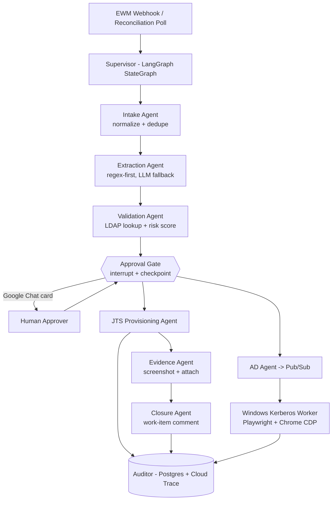

# Plan: Autonomous Multi-Agent ALM Provisioning on Google Cloud

> Status: Draft for review — 2026-08-26
> Scope: Convert the ALM Access Retrieval toolkit from human-driven Copilot chat modes
> into an autonomous multi-agent system deployed on Google Cloud.

---

## 1. Executive Summary

Today the "agents" in this repository are VS Code Copilot Chat `.agent.md` modes. A human must
sit in the editor, type a password at a `getpass()` prompt, and pass `--commit`. That is
assisted automation, not autonomy.

To make this autonomous, the seven CLI scripts must become a reusable tool library, wrapped in
a **LangGraph** supervisor graph with a durable human-approval gate, deployed to **Google Cloud
Cloud Run** with private connectivity back to the corporate intranet.

One component cannot move to Linux: GPT provisioning requires Windows Kerberos SSO through a
real Edge process. It becomes a separate domain-joined worker fed by an Pub/Sub queue.

**Critical principle: the LLM is never in the write path.** Vertex AI is used for messy
free-text parsing, comment drafting, and anomaly triage. Every write goes through typed,
validated, idempotent tool functions.

---

## 2. Confirmed Decisions

| Decision | Choice |
| --- | --- |
| Cloud platform | Google Cloud (Cloud Run, not AKS) |
| Agent framework | LangGraph (Python) |
| LLM provider | Vertex AI (corporate subscription) |
| Autonomy level | Autonomous read/plan; human approves each write batch |
| Trigger model | EWM webhook / event subscription (with poll fallback) |
| Service account | Non-interactive service account available or requestable |

---

## 3. Current State

### 3.1 Inventory

| File | Responsibility |
| --- | --- |
| `src/alm_access_requests.py` | EWM OSLC query; parses `New Users` field to `out/alm_users.json` |
| `src/jts_import_users.py` | `searchRegistry` (LDAP) + `multipleNewContributors` |
| `src/jts_unarchive_user.py` | GET contributor RDF, flip `jfs:archived`, conditional PUT with ETag |
| `src/ewm_comment_workitems.py` | `group_by_workitem()`, `jts_status_map()`, `post_comment()` via OSLC comment factory |
| `src/jts_profile_attach.py` | Playwright msedge screenshots, `IAttachmentRestService` upload, OSLC partial PUT |
| `src/elm_gpt.py` | Playwright CDP attach to Incognito Chrome on :9222; GPT JSF UI; AD group `GR_D-JazzUser-NA` |
| `src/ewm_workitems.py` | Generic OSLC work-item lister |
| `scripts/setup.ps1` | venv bootstrap with offline `wheels/` fallback |
| `scripts/start-gpt.ps1` | Launches debug Chrome on port 9222 |

### 3.2 Defects Blocking Autonomy

- Jazz form-auth `login()` duplicated across six modules; `_load_local_env()`, XML parsing and
  OSLC pagination also duplicated.
- `verify=False` plus `urllib3.disable_warnings()` throughout — TLS verification is disabled.
  **This is the single biggest security defect in the repository.**
- `getpass.getpass()` makes every script interactive-only.
- No logging, no tests, no CI, no retry/backoff, no idempotency, no audit trail.
- Windows-only dependencies: PowerShell, Edge, Kerberos SSO.

---

## 4. Hard Constraints and Risks

1. **Intranet-only endpoints.** EWM and JTS live on `*.intra.chrysler.com`. Google Cloud requires
   Direct VPC egress plus Cloud Interconnect or HA VPN and Cloud DNS.
2. **Self-signed corporate certificates.** A corporate CA bundle must be mounted; do not
   restore `verify=False`.
3. **Kerberos SSO cannot run in a Linux container.** GPT provisioning needs a domain-joined
   Windows worker consuming a Pub/Sub queue.
4. **EWM/RTC webhook support is weak.** Plan a webhook receiver *and* a reconciliation poll.
5. **PII exposure.** Names, emails and user IDs must not reach Vertex AI unnecessarily.
   Deterministic parsing runs first; the LLM is a redacted fallback only.

---

## 5. Target Architecture

### 5.1 Agent Responsibilities

| # | Agent | Responsibility | LLM? |
| --- | --- | --- | --- |
| 1 | Intake | Webhook/poll to normalized `WorkItem` records; dedupe | No |
| 2 | Extraction | Regex-first parse of `New Users`; LLM fallback for malformed text | Fallback only |
| 3 | Validation | JTS `searchRegistry`; classify READY/EXISTS/ARCHIVED/INVALID; risk score | No |
| 4 | Approval Gate | LangGraph `interrupt()`, durable checkpoint, Google Chat card | No |
| 5 | JTS Provisioning | Create contributor / unarchive; idempotent | No |
| 6 | AD Provisioning | Enqueue to Pub/Sub for the Windows Kerberos worker | No |
| 7 | Evidence | JTS profile screenshot; EWM attachment | No |
| 8 | Closure | LLM-drafted, template-validated work-item comment | Yes, validated |
| 9 | Auditor | Structured audit events to Postgres and Cloud Trace | No |

---

## 6. Implementation Phases

### Phase 0 — Foundation Refactor
*Blocks every other phase.*

1. Create the `src/alm_core/` package:
   - `config.py` — pydantic-settings configuration
   - `auth.py` — single Jazz session factory with retry and backoff, replacing the six
     duplicated `login()` functions
   - `oslc.py` — consolidated `parse_xml()`, `ln()`, and the pagination loop
   - `logging.py` — structlog JSON logging
   - `errors.py` — typed exception hierarchy
2. Remove every `verify=False` and `urllib3.disable_warnings()`; replace with an explicit
   corporate CA bundle path.
3. Replace `getpass.getpass()` with a credential provider abstraction:
   environment variable, then Secret Manager, then interactive fallback.
4. Add `pyproject.toml`, ruff, mypy, and pytest with recorded HTTP fixtures.
5. Keep the existing CLI entry points working as thin wrappers so nothing breaks.

### Phase 1 — Tool Layer and Contracts
*Depends on Phase 0.*

6. Define Pydantic models: `WorkItem`, `RequestedUser`, `UserStatus`, `ProvisionResult`,
   `ApprovalDecision`, `AuditEvent`.
7. Build idempotent tools in `src/alm_core/tools/` (`ewm.py`, `jts.py`, `evidence.py`,
   `gpt_queue.py`). Idempotency key is `sha256(workitem_id + userid + operation)`, persisted
   in Postgres, so a replayed webhook can never double-create a contributor.

### Phase 2 — LangGraph Orchestration
*Depends on Phase 1.*

8. Build `src/alm_agents/graph.py` — a `StateGraph` with one node per agent and conditional
   edges for the READY/EXISTS/ARCHIVED/INVALID branches.
9. Wire an `AsyncPostgresSaver` checkpointer (Cloud SQL for PostgreSQL)
   so a run survives container restarts while paused for approval.
10. Place `interrupt()` at the approval node.
11. Connect Vertex AI through `ChatVertexAI` with a Workload Identity token provider.
12. Run end-to-end locally against the TEST server before any cloud work begins.

### Phase 3 — Approval Surface
*Can run in parallel with Phase 2 once contracts exist.*

13. Build the FastAPI app `src/alm_api/` exposing `POST /webhooks/ewm`,
    `POST /approvals/{thread_id}`, and `GET /runs`.
14. Deliver a Google Chat card listing users and risk flags, using signed expiring approval
    tokens. Record approver identity in the audit log.
15. Provide a minimal IAP-authenticated web approval page as fallback.

### Phase 4 — Containerization and Infrastructure as Code
*Can run in parallel with Phase 3.*

16. Write a `python:3.13-slim` Dockerfile for the orchestrator and API, with the corporate CA
    baked in. Reuse the `wheels/` offline fallback for air-gapped builds.
17. Author Terraform templates in `infra/`: VPC-attached Cloud Run service, Container App,
    Secret Manager, Cloud SQL for PostgreSQL behind a private service connection, Pub/Sub, Application
    Insights, Artifact Registry, service account, and Cloud DNS private zones.
18. Create the CI pipeline: lint, test, build, push to Artifact Registry, deploy.

### Phase 5 — Google Cloud Networking
*Depends on Phase 4.*

19. Establish Cloud Interconnect or HA VPN to the corporate network.
20. Configure Cloud DNS resolution for `*.intra.chrysler.com` and firewall rules for EWM/JTS.
21. Add a connectivity smoke job that runs on every deployment.
22. Populate Secret Manager: service-account password, Vertex AI credential, approval signing key.

### Phase 6 — Windows Kerberos Worker
*Can run in parallel with Phase 5.*

23. Stand up a domain-joined Windows host (on-prem recommended initially) running a service
    that pulls AD jobs from Pub/Sub and drives Playwright over CDP, reusing the logic in
    `src/elm_gpt.py` including the polling verification in `add_user()`.
24. Use a gMSA or service account for unattended Kerberos — no interactive login, no
    `scripts/start-gpt.ps1`.
25. Add heartbeat reporting and dead-letter handling.

### Phase 7 — Triggers
*Depends on Phases 2 and 5.*

26. **Spike first:** confirm whether EWM/RTC can emit outbound HTTP at all.
27. Implement the webhook receiver with HMAC signature verification and replay protection.
28. Add a 15-minute reconciliation poll as a safety net for missed events.

### Phase 8 — Hardening
*Depends on all prior phases.*

29. Emit OpenTelemetry traces to Cloud Trace, including LangGraph run traces.
30. Maintain an immutable audit table: who, what, when, approved-by, idempotency key, result.
31. Enforce secret redaction in logs and PII minimization before any LLM call.
32. Add rate limiting and circuit breakers on EWM and JTS calls.
33. Write the operational runbook: rollback, dead-letter replay, manual override, on-call.

### Phase 9 — Pilot Rollout

34. Run shadow mode on TEST (read and plan, no writes); diff results against manual outcomes.
35. Enable writes with mandatory approval; measure approval latency and error rate.
36. Selectively auto-approve low-risk operations (comments, screenshots) once trusted.

---

## 7. Files to Modify or Reuse

| Path | Action |
| --- | --- |
| `src/alm_access_requests.py` | Move `login()`, `parse_xml()`, `project_uuid()`, `workflow_states()`, `Resolver` into `alm_core`; the `New Users` token parser becomes the Extraction Agent's deterministic path |
| `src/jts_import_users.py` | `search_registry()`, `resolve_user()`, `create_contributor()` become the Validation and JTS Provisioning tools |
| `src/jts_unarchive_user.py` | ETag conditional PUT is already idempotent — keep the pattern and generalize it |
| `src/ewm_comment_workitems.py` | `group_by_workitem()` and `post_comment()` (including `X-Jazz-CSRF-Prevent` handling) become the Closure Agent |
| `src/jts_profile_attach.py` | Preserve the `IAttachmentRestService` multipart plus OSLC partial PUT workaround verbatim — the OSLC 415 quirk is server-specific |
| `src/elm_gpt.py` | Moves wholesale to the Windows worker |
| `src/ewm_workitems.py` | Pagination loop merges into `alm_core/oslc.py`; CLI stays as a diagnostic tool |
| `scripts/setup.ps1` | Stays for local development; `wheels/` fallback moves into the Docker build |
| `requirements.txt` | Superseded by `pyproject.toml` |

### New dependencies

`langgraph`, `langchain-google-vertexai`, `fastapi`, `pydantic-settings`, `google-auth`,
`google-cloud-pubsub`, `google-cloud-secret-manager`, `psycopg`, `structlog`,
`opentelemetry-sdk`, `opentelemetry-instrumentation-fastapi`.

---

## 8. Verification

1. `pytest` suite green; `ruff check` and `mypy` clean.
2. `grep -r "verify=False" src/` returns no results.
3. Connectivity smoke test from the Container App to EWM and JTS over the private network.
4. End-to-end TEST run: webhook, extraction, validation, Chat card, approval, JTS contributor
   created, comment posted on the work item.
5. **Idempotency test:** replay the same webhook three times; exactly one contributor is created
   and two no-ops are logged.
6. **Durability test:** kill the container while a run is paused at the approval gate, restart,
   and confirm it resumes from the Postgres checkpoint.
7. **Kerberos test:** the Windows worker stages users in GPT with no interactive login and
   without `scripts/start-gpt.ps1`.
8. **Security review:** Secret Manager accessed only via Workload Identity; no passwords in the audit
   log; approval tokens expire.

---

## 9. Scope Boundaries

**In scope:** package refactor, LangGraph orchestrator, human-in-the-loop approval, Google Cloud
deployment, Windows Kerberos worker, observability and audit.

**Out of scope:** replacing EWM, JTS or GPT; changing business rules or approval policy;
multi-region high availability; multi-tenant support.

---

## 10. Open Questions

1. **EWM webhook feasibility is unproven.** IBM EWM/RTC has no first-class outbound webhook.
   - Option A: server-side follow-up action plugin (requires admin deployment)
   - Option B: poll-only every 5 minutes — *recommended starting point*
   - Option C: email-to-webhook bridge

2. **Windows worker placement.**
   - Option A: on-prem Windows host — *recommended, Kerberos works without extra setup*
   - Option B: Compute Engine Windows MIG domain-joined over Cloud Interconnect
   - Option C: drop the GPT UI path entirely and modify AD groups via LDAP or Microsoft Graph.
     This is the cleanest long-term answer and would eliminate Playwright from the write path.

3. **Approval channel.**
   - Google Chat card — *recommended*, lower friction but needs bot registration
   - IAP-authenticated web page — faster to ship if bot approval is slow