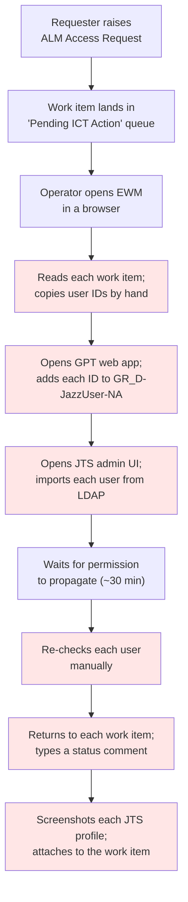
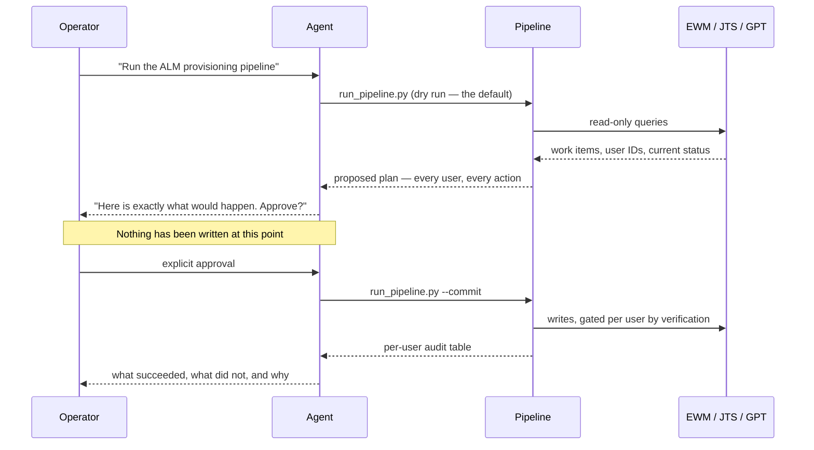
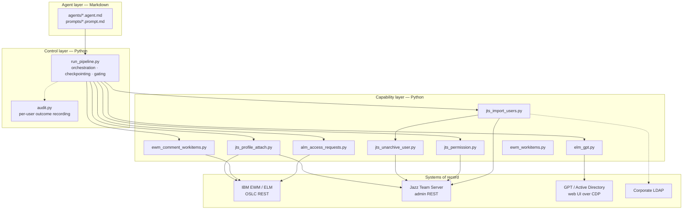
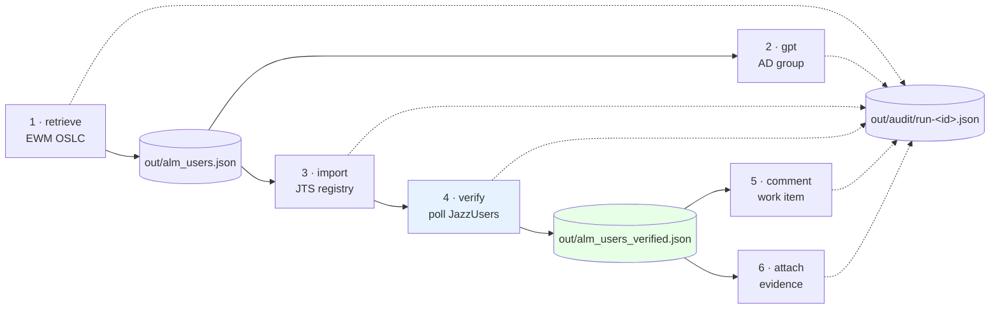

# ALM Access Provisioning Agent — Solution Overview

**Audience:** platform owners, ICT operations leads, security and compliance reviewers, and
engineers joining the project.
**Purpose:** explain what the agent does, how it is built, what it is worth, and how to
demonstrate it credibly.
**Companion document:** [docs/REMEDIATION_PLAN.md](../docs/REMEDIATION_PLAN.md) — the engineering
assessment and remediation roadmap. This document describes the solution; that one describes its
current production readiness. **Read section 8 of this document before demonstrating to a
stakeholder who may ask "can we run this unattended?"**

**Scope:** this overview describes the command-line pipeline (`src/*.py`) as of its
remediation on 2026-09-06. Several things have been built on top of it since:
- the multi-agent system: [AUTONOMOUS_ARCHITECTURE.md](AUTONOMOUS_ARCHITECTURE.md);
- its web console and cloud deployment: [ENTERPRISE_PLAN.md](ENTERPRISE_PLAN.md);
- its operations: [RUNBOOK.md](RUNBOOK.md).

Those documents describe the system as it is now.

---

## 1. Executive summary

Granting a user access to the ALM (Application Lifecycle Management) platform is a routine,
high-volume, entirely manual chore. A request arrives as a work item in IBM EWM/ELM; an ICT
operator reads it, copies the user IDs out by hand, adds them to an Active Directory group in one
web application, imports them into the Jazz Team Server registry in another, waits for the
permission to propagate, then returns to the original work item to record what happened and
attach evidence.

Nothing in that sequence requires judgement. All of it requires accuracy.

This solution automates the full sequence as a **six-step pipeline driven by a human-supervised
agent**. The operator issues one instruction. The agent retrieves the queue, shows exactly what
it proposes to do, waits for explicit approval, then executes and produces a per-user audit trail
of what actually happened.

**What makes it more than a script:**

- **Nothing is written without approval.** Every step defaults to a dry run.
- **Evidence gates the writes.** A user's work item is only updated after the system has
  independently confirmed the permission is live — not after it has merely requested it.
- **Every run is auditable.** Per-user, per-step outcomes with correlation IDs and captured
  stack traces, written to disk as JSON.

**Current status:** proven end-to-end against both TEST and PRODUCTION. Suitable for
**supervised** operation today. Section 8 states plainly what must close before it can run
unattended.

---

## 2. Business context

### 2.1 The manual process being replaced



Every shaded step is manual, repetitive, and — critically — **transcription-based**. A user ID
copied wrong is access granted to the wrong person or denied to the right one, discovered days
later.

### 2.2 Why this was a good automation candidate

| Property | Why it matters |
|---|---|
| High frequency | The queue is continuously replenished; observed runs ranged from 4 to 13 work items and 7 to 17 users |
| Zero judgement | The work item states exactly who needs access; no interpretation required |
| Multi-system | Four systems (EWM, GPT/AD, JTS, LDAP) must agree — exactly where manual process drifts |
| Structured input | The **New Users** field is machine-parseable: `LASTNAME,FIRSTNAME,email,USERID;` |
| Auditable output | Work-item comments and attachments are already the expected evidence format |
| Latency-bound | The ~30-minute permission propagation wastes operator attention, not operator skill |

### 2.3 What changed

| | Before | After |
|---|---|---|
| Operator actions | Dozens of UI interactions per batch | One command, one approval |
| Systems opened by hand | 4 | 0 |
| Transcription steps | One per user, per system | 0 |
| Waiting | Operator polls manually | Automated poll, 5-min interval, 30-min cap |
| Evidence | Manually screenshotted and attached | Captured and attached automatically, per user |
| Audit trail | The work-item comment, if remembered | Structured JSON, every user, every step, every run |
| Failure visibility | Discovered later by the requester | Reported per user at end of run |

---

## 3. Agent functionality

### 3.1 The agent layer

The solution is delivered as **VS Code Copilot agents**: Markdown definitions that give the model
a role, a constrained toolset, and verified domain facts. The agents do not contain the business
logic — they orchestrate deterministic Python scripts and manage the conversation with the
operator.

| Agent file | Role |
|---|---|
| [.github/agents/alm-access-retrieval.agent.md](../.github/agents/alm-access-retrieval.agent.md) | **Read-only.** Retrieves ALM Access Request work items and parses requested user IDs. Explicitly constrained to GET requests. |
| [.github/agents/jts-user-import.agent.md](../.github/agents/jts-user-import.agent.md) | **Write-capable.** Imports users into the JTS registry. Required to dry-run first and obtain explicit confirmation before committing. |

Four prompt files provide task entry points the operator can invoke by name:

| Prompt | What it runs |
|---|---|
| `/retrieve-access-requests` | Retrieval only |
| `/import-users-to-jts` | Dry run → confirm → JTS import |
| `/import-users-to-gpt` | Dry run → confirm → AD group provisioning via GPT |
| `/run-pipeline` | The complete six-step flow |

Each agent carries **verified server facts** — project UUIDs, work-item type identifiers,
workflow state IDs, the exact REST service paths, and the quirks of this specific Jazz build.
This is the accumulated result of the discovery work recorded in
[docs/AGENT_JOURNEY.md](../docs/AGENT_JOURNEY.md), and it is why the agent does not need to
rediscover the environment on every run.

### 3.2 The human-in-the-loop contract



The dry-run-first discipline is enforced in **three independent places**: the agent definitions,
the prompt files, and the `--commit` default in the code itself. A failure in any one layer does
not remove the gate.

### 3.3 Safety controls

| Control | Mechanism |
|---|---|
| Default is read-only | Every script requires an explicit `--commit`; without it, nothing is written |
| Credentials never persisted | Password prompted once at runtime, passed to child steps through the process environment, never written to disk and never read from `.env` |
| Scoped tool auto-approval | [.vscode/settings.json](../.vscode/settings.json) auto-approves exactly one command — the read-only retrieval script — using an anchored exact-match regex. `--commit` cannot be appended without breaking the match |
| Pre-execution guard hook | [.github/hooks/scripts/guard-jts-commit.py](../.github/hooks/scripts/guard-jts-commit.py) denies a commit run when the input file is missing, unreadable, or empty |
| Secret scanning | Pre-commit hooks with Yelp `detect-secrets`, `detect-private-key`, and a maintained baseline |
| Verification gates writes | Only users whose JazzUsers permission is confirmed live receive a comment or attachment |
| Per-user isolation | One malformed user ID cannot abort a batch; each is caught, recorded, and the run continues |

---

## 4. Codebase architecture

### 4.1 Layers



**Design principle:** each capability script is independently runnable with the same CLI
conventions (`--users-in`, `--commit`, `--limit`, `--user`). When the pipeline stalls, an
operator drops to the single step that failed rather than re-running everything.

### 4.2 Module reference

| Module | Responsibility | Writes? |
|---|---|---|
| [src/alm_access_requests.py](../src/alm_access_requests.py) | Queries EWM over OSLC; discovers project area and workflow states; parses the **New Users** field; emits `out/alm_users.json` | No |
| [src/elm_gpt.py](../src/elm_gpt.py) | Attaches to an authenticated debug Chrome over CDP; adds user IDs to AD group `GR_D-JazzUser-NA` through the GPT web UI | Yes |
| [src/jts_import_users.py](../src/jts_import_users.py) | Looks each user up in LDAP, registers the JTS contributor, reactivates archived accounts | Yes |
| [src/jts_unarchive_user.py](../src/jts_unarchive_user.py) | Reads the contributor RDF and clears the `archived` flag via a conditional PUT | Yes |
| [src/jts_permission.py](../src/jts_permission.py) | Polls until every user holds the `JazzUsers` role **and** is not archived | No |
| [src/ewm_comment_workitems.py](../src/ewm_comment_workitems.py) | Posts the outcome comment back onto the originating work item | Yes |
| [src/jts_profile_attach.py](../src/jts_profile_attach.py) | Captures a JTS profile screenshot per user and attaches it to the work item as evidence | Yes |
| [src/run_pipeline.py](../src/run_pipeline.py) | Orchestrates all six steps; single password prompt; checkpoint and resume; final report | Orchestrates |
| [src/audit.py](../src/audit.py) | Run-correlated per-user outcome records with captured tracebacks | Audit only |
| [src/ewm_workitems.py](../src/ewm_workitems.py) | Generic work-item lister for exploring other project areas | No |

### 4.3 Pipeline flow and data contracts



Steps 5 and 6 consume `out/alm_users_verified.json`, **not** the full user list. This is the
single most important architectural decision in the system: a user whose permission has not been
independently confirmed receives no comment and no evidence attachment. The work item is never
told something that has not been checked.

| Artifact | Contents |
|---|---|
| `out/alm_users.json` | Unique users with `userid`, `email`, `first_name`, `last_name`, `source_work_items[]` |
| `out/alm_users_verified.json` | The subset whose JazzUsers permission is confirmed live |
| `out/pipeline_state.json` | Per-step completion, exit codes, timestamps, per-user verification results — the basis for `--resume` |
| `out/audit/run-<id>.json` | Every per-user record from every step, merged, with poll metadata |
| `out/screenshots/<USERID>.png` | Profile evidence captured for attachment |

### 4.4 Integration approach

Three integration styles, each chosen for a reason:

| System | Method | Why |
|---|---|---|
| EWM / ELM | **OSLC REST API** | Structured, headless, fast. No browser, no Jazz SDK. Environment-aware form auth that *discovers* the login endpoint rather than hardcoding it — TEST and PROD differ |
| JTS | **Internal admin REST services** | The registry is LDAP-backed and read-only, so contributors must be *imported from LDAP*, exactly as the admin UI does. A plain create is rejected by the server |
| GPT | **Browser automation over CDP** | GPT is a JSF application behind Windows Kerberos SSO with no API. Playwright attaches to an already-authenticated debug Chrome, preserving the operator's Kerberos ticket |

The codebase documents the *why* behind non-obvious choices — for example, that the OSLC
attachment factory returns HTTP 415 on this server, forcing uploads through the web client's
multipart service followed by an OSLC partial PUT.

---

## 5. Key features

### 5.1 Operational

- **One command, end to end.** `python src/run_pipeline.py` executes all six steps.
- **Single password prompt** for the whole run, shared with child steps through the process
  environment.
- **Checkpoint and resume.** `--resume` continues from the last completed step, so a 30-minute
  permission wait is never repeated because of a later failure.
- **Selective execution.** `--skip-retrieve`, `--skip-gpt`, `--workitem <ID>`, `--limit N` for
  targeted re-runs.
- **Offline installation.** Vendored `wheels/` and `scripts/setup.ps1` handle a corporate network
  that blocks PyPI.

### 5.2 Correctness

- **Verification before assertion.** A user is verified only when the `JazzUsers` role is present
  **and** the account is not archived — a partial signal is not accepted.
- **Independent evidence confirmation.** Before a profile screenshot is captured, the system
  requires an `<input>` element on the rendered page whose value equals the requested user ID.
  A login page cannot satisfy this, so a redirect cannot be mistaken for a profile.
- **Post-write re-read.** After creating a contributor, the system re-reads it rather than
  trusting the create response.
- **Archived-user handling.** Users who already exist but are archived are detected and
  reactivated automatically — the most common cause of an apparent "failure" in the manual
  process.

### 5.3 Auditability

- **Run correlation ID** shared by every step and child process.
- **Per-user, per-step records** with status, outcome, message and full stack traces.
- **User × step summary matrix** printed at the end of every run.
- **Actionable recovery output** — unverified users are listed with the exact command to
  re-check them.

### 5.4 Resilience

- **Per-user isolation** in every loop.
- **Distinct exit codes** — 0 success, 1 step failure, 2 authentication failure, 3 audit
  failures or timeouts — so the run is scriptable.
- **Audit report on failure paths too.** A failed run still produces its evidence.
- **Split connect/read timeouts** on every HTTP call.

---

## 6. Business demonstration

A 20-minute demo. Run it against **TEST** (`prssetst`), never PROD.

### 6.1 Preparation checklist

| | Item |
|---|---|
| ☐ | `.env` points at TEST — confirm `EWM_SERVER` and `JTS_SERVER` both contain `prssetst` |
| ☐ | On the corporate intranet or VPN |
| ☐ | `.venv` active and dependencies installed (`scripts/setup.ps1`) |
| ☐ | `scripts/start-gpt.ps1` run, logged into GPT in the debug Chrome window |
| ☐ | At least 2-3 test work items sitting in the Pending ICT Action queue |
| ☐ | A previous run's `out/audit/run-<id>.json` open in a second window, to show the audit output without waiting |
| ☐ | Password to hand — you will type it into the terminal, on screen, once |

> **Set expectations up front:** the permission poll can take up to 30 minutes. Either use
> pre-verified users, or narrate the wait and cut to a completed run's audit file.

### 6.2 Run sheet

#### Act 1 — The problem (3 min)

Open the EWM **Pending ICT Action** queue in a browser. Do not use the tool yet.

> "This is the queue. Each item names one or more people who need ALM access. Today an operator
> reads each one, copies the IDs by hand, adds them to an AD group in one application, imports
> them into the Jazz server in another, waits half an hour, then comes back here to type a
> comment and attach a screenshot for each person. It is four systems and a lot of copying. It
> takes as long as it takes, and every copy is a chance to get someone's access wrong."

Open one work item. Point at the **New Users** field: `LASTNAME,FIRSTNAME,email,USERID;`.

> "That field is the whole input. It is already structured. That is why this is automatable."

#### Act 2 — Retrieval (3 min)

```powershell
python src/alm_access_requests.py
```

Type the password when prompted — on screen, deliberately.

> "The password is typed here, at runtime, by the operator. It is never in a file, never in the
> repository, and never in the agent's context."

Show the parsed output and `out/alm_users.json`.

> "Read-only. Nothing has been changed anywhere. This step is the one command the environment
> auto-approves — because it provably cannot write."

Show the auto-approve rule in [.vscode/settings.json](../.vscode/settings.json).

> "Anchored, exact match, and it only matches the retrieval script with no arguments. You cannot
> append `--commit` and have it still auto-approve."

#### Act 3 — The approval gate (4 min) — *the centrepiece*

```powershell
python src/run_pipeline.py
```

> "This is the full pipeline — and it is a dry run. That is the default. Every step runs in
> read-only form and shows me exactly what it would do."

Walk the output: users found, what would be added to the AD group, what would be imported into
JTS, which work items would be commented on.

> "Nothing has been written. To make it write, I have to pass `--commit` explicitly, and the
> agent is required to show me this list and get my confirmation first. That rule is written into
> the agent definition, the prompt, and the code default — three separate places."

Show the guard hook.

> "And there is a hard stop underneath it. If the input file is missing or empty, the commit is
> refused before it runs. It cannot be talked out of that — it is not part of the conversation."

#### Act 4 — Execution and verification (6 min)

```powershell
python src/run_pipeline.py --commit
```

Narrate as the steps run. When the verify step begins:

> "This is the part that matters most. Adding someone to the group is not the same as them having
> access — the permission takes up to thirty minutes to propagate. So the system polls until it
> can independently confirm the role is live. Users who are not confirmed get **nothing** written
> to their work item. We never tell a requester their access is ready when it is not."

When it completes, show the summary matrix, then the work item in the browser: the comment and
the attached profile screenshot.

> "That evidence was captured after the permission was confirmed, and the capture itself is
> checked — the system requires the rendered page to contain the user's own ID before it will
> take the screenshot. It will not attach a login page by mistake."

#### Act 5 — The audit trail (3 min)

Open `out/audit/run-<id>.json`.

> "Every user, every step, every outcome, with a run correlation ID and full stack traces on
> anything that failed. If someone asks in three months who granted access to whom and when, this
> is the answer — and it is a file, not a memory."

#### Act 6 — Honesty and roadmap (2 min)

See section 8. Do not skip this.

### 6.3 Anticipated questions

| Question | Answer |
|---|---|
| *Can it run unattended overnight?* | Not yet. Section 8 lists exactly what must close first. Today it is supervised: one operator, one approval, one observed run. |
| *What if it grants access to the wrong person?* | The input is the work item's own structured field — there is no transcription step to get wrong. And the write steps only act on users whose permission the system has independently confirmed. |
| *What if it runs twice?* | Today that would post duplicate comments and attachments. It is a known gap with a defined fix (P0-2 in the review). It does not grant duplicate access — the underlying systems are idempotent about membership. |
| *Where are the credentials?* | Nowhere. Prompted at runtime, held in process memory for the duration, never written to disk and never placed in the agent's context. |
| *Can the AI decide to do something we did not ask?* | Its tools are constrained by the agent definition, every write requires an explicit flag, the approval gate is enforced in three layers, and a guard hook blocks commits with invalid input. The retrieval agent is read-only by construction. |
| *What happens when it fails halfway?* | Per-user isolation means the rest of the batch completes. The audit trail records exactly which users were affected. `--resume` continues from the last completed step. |
| *How much does it save?* | See section 7 — we present a model and the assumptions behind it, not a number we have measured yet. |
| *What does it cost to run?* | Three Python dependencies, no infrastructure, no per-transaction cost. It runs on the operator's workstation. |

---

## 7. Value and use cases

### 7.1 Where the value comes from

Ranked by confidence, not by size:

1. **Elimination of transcription risk.** The system reads the ID from the same field a human
   would read, but cannot mistype it. This is the benefit we are most certain of.
2. **Evidence discipline.** Comments and screenshots are produced consistently, after
   verification, on every run — not when someone remembers.
3. **Audit trail that did not previously exist.** A structured, per-user record of who was
   provisioned, when, by which run, and with what outcome.
4. **Reclaimed attention during the propagation wait.** The operator is not tied to a browser
   polling for thirty minutes.
5. **Cycle-time reduction.** Real, but the smallest and hardest-to-attribute component.

### 7.2 Effort model

We have not yet measured the manual baseline. Rather than assert a saving, here is the model to
populate — the review's observability work makes these directly measurable from the audit
data.

| Quantity | Symbol | How to obtain |
|---|---|---|
| Work items per batch | $W$ | Observed: 4 to 13 |
| Users per batch | $U$ | Observed: 7 to 17 |
| Manual minutes per user | $t_u$ | **To be measured** — time one operator through the current process |
| Manual minutes per work item | $t_w$ | **To be measured** |
| Batches per month | $B$ | From the queue's historical volume |

$$\text{Monthly hours recovered} \;=\; \frac{B \times \left( U \cdot t_u + W \cdot t_w \right) - B \times t_{\text{supervised}}}{60}$$

where $t_{\text{supervised}}$ is the operator time still required per batch — issuing the
command, reviewing the plan, approving, and reading the result. Note that $t_{\text{supervised}}$
is roughly **constant with respect to batch size**, whereas the manual term scales linearly with
$U$. That is the shape of the benefit: the larger the batch, the greater the advantage.

> **Do not present a savings figure until $t_u$ and $t_w$ are measured.** A model with honest
> placeholders is more persuasive to a sceptical reviewer than a number that cannot be defended.

### 7.3 Current use cases

| Use case | Entry point |
|---|---|
| Full provisioning of the pending queue | `/run-pipeline` |
| Retrieval and reporting only — who is waiting? | `/retrieve-access-requests` |
| JTS registry import only | `/import-users-to-jts` |
| AD group provisioning only | `/import-users-to-gpt` |
| Re-check permission for specific users | `python src/jts_permission.py <ids> --wait 30` |
| Reactivate a specific archived user | `python src/jts_unarchive_user.py <id> --commit` |
| Explore other EWM project areas | `python src/ewm_workitems.py --list` |
| Reconstruct a past run for an audit query | Read `out/audit/run-<id>.json` |

### 7.4 Extension opportunities

The architecture generalises along three axes:

- **Other work-item types.** The retrieval layer is parameterised by project area, work-item type
  and workflow state. A different request type is configuration, not new code.
- **Other target systems.** The capability layer is a set of interchangeable steps behind a common
  CLI contract. Adding a system means adding one script, not restructuring the pipeline.
- **Access removal.** The reverse flow — deprovisioning on offboarding — reuses the same
  retrieval, verification and evidence machinery. This is the highest-value adjacent use case and
  should be scoped only after the P0 items in the review are closed, because deprovisioning
  errors are less forgiving than provisioning errors.

Beyond this specific queue, the reusable pattern is: **structured request → agent-orchestrated
multi-system action → independently verified outcome → evidence written back to the request.**
That pattern applies to most ICT fulfilment work.

---

## 8. Maturity and honest positioning

This section exists so that nobody demonstrates the solution and then discovers section 8 of the
engineering review in front of a stakeholder.

### 8.1 What to say

> "It is proven end to end, in TEST and in production, and it runs supervised today — one
> operator, one approval, one observed run. We have completed a full engineering review, we know
> precisely what stands between here and unattended operation, and it is a defined list of six
> items, not an open question."

### 8.2 What is genuinely strong

- The verification gate — unverified users get nothing written to their work item.
- The evidence confirmation mechanism, which cannot be satisfied by a login page.
- The audit trail: run-correlated, per-user, with captured stack traces.
- Credential handling: prompted once, never persisted.
- The scoped tool auto-approval rule, which is a reference-quality example of narrow permission.
- Per-user isolation throughout.

### 8.3 What is not yet ready

The six blocking items recorded in [docs/REMEDIATION_PLAN.md](../docs/REMEDIATION_PLAN.md)
were implemented on 2026-09-06 — see the status section at the top of that document for the
item-by-item mapping. In summary:

| | Gap | Now |
|---|---|---|
| P0-1 | The approved plan was not bound to the executed plan | A dry run fingerprints its plan; a mismatched commit is refused and names the difference |
| P0-2 | Writes were not idempotent | Comments carry a content-derived marker and attachments match on filename; a re-run skips what it already wrote |
| P0-3 | The guard hook covered one of five write entry points | It covers all six, and CI fails if a new one is added without it |
| P0-4 | Evidence artifacts were not checked for distinctness | The attach step refuses a batch in which two users share an artifact |
| P0-5 | There were no automated tests and no CI | An offline test suite (126 tests then; it has grown with the agents) plus lint on every push |
| P0-6 | A dry run did not faithfully preview the commit | The commit executes the fingerprinted plan or aborts |

Work-item comments now state what happened to each user — added, reactivated, or already
present — instead of asserting *"User added to JTS"* for everyone (P1-4).

**What remains open:** TLS verification is implemented but not switched on by default
(P1-2 — set `ALM_CA_BUNDLE` to the corporate CA bundle and it verifies); the 30-minute
permission wait still blocks a terminal; and none of this has yet been exercised against the
live servers. Treat the first run as a dry run on TEST.

### 8.4 Recommended positioning by audience

| Audience | Frame it as |
|---|---|
| ICT operations | A supervised assistant that removes the copying and the waiting, with an audit trail as a by-product |
| Platform ownership | A working reference implementation of agent-driven fulfilment, with a costed path to autonomy |
| Security and compliance | Defence in depth — read-only by default, three-layer approval, scoped tool permissions, no persisted credentials, complete audit trail — with the TLS and environment-separation gaps disclosed and scheduled (P1-2, P1-3) |
| Engineering leadership | A candid case study: what agent-driven automation gets right, and what it costs to make trustworthy |

---

## 9. Quick reference

### Setup

```powershell
.\scripts\setup.ps1                        # one-time; falls back to wheels/ offline
Copy-Item .env.example .env                # then set EWM_SERVER, JTS_SERVER, CID
```

### Everyday operation

```powershell
.\scripts\start-gpt.ps1                    # only needed for the GPT step
python src\run_pipeline.py                 # dry run — always do this first
python src\run_pipeline.py --commit        # after reviewing the plan
python src\run_pipeline.py --commit --resume   # continue an interrupted run
```

### Targeted operations

```powershell
python src\alm_access_requests.py --all-open --csv out\queue.csv
python src\jts_import_users.py --limit 1 --commit
python src\jts_permission.py AB12345 CD67890 --wait 30 --interval 5
python src\ewm_comment_workitems.py --workitem 4348411
python src\jts_profile_attach.py --skip-shots --workitem 4348411 --commit
```

### Interpreting exit codes

| Code | Meaning |
|---|---|
| 0 | All steps succeeded |
| 1 | A step failed, or input was invalid |
| 2 | Authentication failed — check password, intranet or VPN |
| 3 | The run completed but the audit contains failures or permission timeouts |

### Further reading

| Document | Purpose |
|---|---|
| [README.md](../README.md) | File-by-file reference: what each file is and why it exists |
| [docs/AGENT_JOURNEY.md](../docs/AGENT_JOURNEY.md) | Build journal — the roadblocks and why each design decision was made |
| [docs/REMEDIATION_PLAN.md](../docs/REMEDIATION_PLAN.md) | Engineering assessment, defect register and remediation roadmap |
